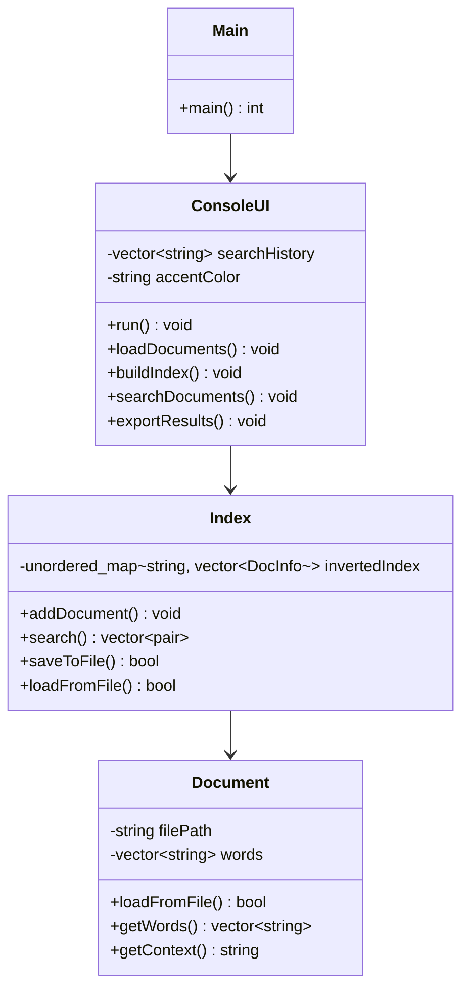

# Txt-Search-Engine
📖 Introducere și Descriere
Txt-Search-Engine este o aplicație modernă, dezvoltată integral în limbajul C++ (standard C++17), având ca scop principal indexarea rapidă și căutarea eficientă a informațiilor textuale dintr-o colecție de documente locale.

Spre deosebire de metodele tradiționale de căutare secvențială (care parcurg fiecare fișier linie cu linie), acest proiect implementează o arhitectură bazată pe Indexare Inversată (Inverted Index). Această abordare permite interogarea bazei de date în timp real  O(1), indiferent de volumul total al documentelor procesate.

🎯 Obiectivele Proiectului

-Performanță Maximă: Utilizarea structurilor de date eficiente (std::unordered_map) pentru a minimiza timpul de răspuns la căutări.

-Experiență Utilizator (UX) Superioară: Crearea unei interfețe tip TUI (Text User Interface) care oferă feedback vizual instantaneu, navigare ușoară și o prezentare modernă a datelor, fără a depinde de librării externe.

-Persistență: Capacitatea de a salva și încărca starea indexului, permițând utilizatorului să păstreze rezultatele prelucrării între sesiuni diferite.

️Abordarea Tehnică

Proiectul este structurat modular, respectând principiile Programării Orientate pe Obiecte (POO):
Core-ul Motorului (Index & Document): Se ocupă de tokenizarea textului, normalizarea cuvintelor și construirea dicționarului inversat care asociază fiecare termen unic cu lista documentelor în care apare.

Interfața Utilizatorului (ConsoleUI & Terminal): Gestionează interacțiunea cu utilizatorul prin manipularea directă a bufferului terminalului (termios), permițând capturarea tastelor speciale (săgeți, ESC) și redarea dinamică a interfeței (bare de progres, evidențiere culori).
Gestiunea Datelor: Utilizează librăria <filesystem> din C++17 pentru iterarea recursivă a directoarelor și manipularea sigură a căilor de fișiere.

💡 De ce acest proiect?

Această aplicație demonstrează puterea limbajului C++ în manipularea rapidă a fluxurilor mari de date text și arată cum pot fi implementate algoritmi complecși de sortare și căutare într-un mediu "low-level", obținând o aplicație rapidă, stabilă și portabilă

✨ Funcționalități Principale

🔍 Căutare Full-Text: Găsește cuvinte în timp real într-o bază de date mare de documente.

📈 Algoritm de Relevanță: Sortează rezultatele bazându-se pe frecvența cuvântului căutat în fiecare document.

🎨 Interfață TUI Avansată: Meniu interactiv în consolă, suport pentru săgeți, culori și teme personalizabile.

🔦 Evidențiere Context: Afișează propoziția în care apare cuvântul căutat, cu diacritice corecte.

💾 Persistență: Salvează indexul în baza de date (search_index.db) pentru a evita re-indexarea la fiecare rulare.

📂 Suport C++17: Utilizează <filesystem> și <chrono> pentru manipularea fișierelor și performanță.

📊 Statistici Live: Vizualizarea numărului de documente, cuvinte indexate și istoricul căutărilor.
Ghid de Utilizare (User Guide)

# Compilare și Rulare
Asigură-te că ai g++ (versiunea 11+) și make instalate.
# Clonează repository-ul
git clone https://github.com/NUMELE_TAU/Txt-Search-Engine.git
cd Txt-Search-Engine

# Compilează proiectul
make

# Rulează aplicația
./search_engine

# Fluxul de Lucru

1)Încarcă documente: Plasează fișierele .txt în folderul documente/ și selectează opțiunea 1.

2)Construiește index: Selectează opțiunea 2. Se va crea baza de date internă.

3)Caută: Selectează opțiunea 3 și tastează cuvântul dorit.

4)Salvează: Selectează opțiunea 5 pentru a salva progresul. Data viitoare, apasă 6 pentru a încărca direct.

# Navigare în Interfață

↑ / ↓ : Navigare meniu

Enter : Selectare opțiune

T : Schimbare temă culori (Cyan / Blue / Green)

# 🏗️ Arhitectură și Tehnologie

